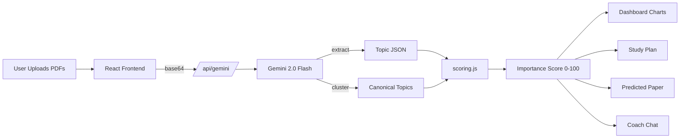

# 🧠 DecodeX — AI Past Paper Analyzer

> Stop guessing what to study. Upload past papers, get a ranked map of high-yield topics + a personalized study plan in 60 seconds.

**Submission for AI DecodeX Hackathon by UnsaidTalks (May 2026).**

🌐 **Live Demo:** [https://ai-decode-x-hackathon.vercel.app](https://ai-decode-x-hackathon.vercel.app)
🎬 **Demo Video:** [Watch on Google Drive](https://drive.google.com/file/d/1Hn6XqwYy2JfjCWWs6MR_W6NKMs5VoAEI/view?usp=sharing)
💻 **Repository:** [github.com/Deepikachintamreddy/AI-DecodeX-Hackathon](https://github.com/Deepikachintamreddy/AI-DecodeX-Hackathon)

> ⚠️ **Note for judges:** This demo runs on Google Gemini's **free tier** with strict daily quotas.
> If you hit a quota error while uploading real PDFs, please click **"Try with sample data"** —
> all features (dashboard, study planner, predicted paper, chat coach) work without any API calls.
> The sample data path showcases the full product capability.

---

## ✨ What it does


Most students prep for exams by *re-reading the syllabus* and *flipping through past papers*. They have no structured way to know **what's actually likely to appear**. DecodeX fixes that:

1. **Upload past papers** (PDF or image, multi-year, multi-subject)
2. **AI extracts every question** → tags it with topic, marks, difficulty, type
3. **Semantic clustering** merges variants of the same concept ("F=ma" ≡ "Newton's 2nd Law")
4. **Importance score** ranks every topic on a weighted formula (frequency + recency + trend + marks)
5. **Syllabus cross-reference** finds gaps (in syllabus, never asked) and surplus (asked, but not in your syllabus)
6. **Smart study planner** auto-generates a day-by-day plan front-loaded with high-yield topics
7. **Predicted next paper** generates a realistic mock paper for the upcoming exam
8. **Chat coach** answers tactical questions like *"What should I study tonight if I have 2 hours?"*

---

## 🎯 Key Innovation

**Most "past paper analyzer" tools just count keyword frequency. DecodeX is different:**

### The Importance Score Formula

```
Score = (0.4 × Frequency)  +  (0.3 × Recency)  +  (0.2 × Trend Slope)  +  (0.1 × Marks Weight)
```

- **Frequency** — how often the topic appears across all papers
- **Recency** — exponential decay weighting recent years more (half-life ~1.4y)
- **Trend Slope** — linear regression on year-counts (catches *rising* topics before they peak)
- **Marks Weight** — high-mark questions matter more than 1-mark MCQs

This catches signals a counter misses. Example: a topic asked twice in 2024 with 12 marks each beats a topic asked five times in 2018 with 2 marks each — and the formula proves it.

### Semantic Clustering
Uses Gemini to merge topic variants like *"BST insertion"*, *"Insert into Binary Search Tree"*, and *"BST insert algorithm"* into one canonical concept — keyword matchers miss this entirely.

### Predicted Next Paper
Goes beyond analytics: generates a realistic mock paper for the upcoming exam based on observed patterns. Section structure, mark distribution, question phrasing — all match your historical papers.

---

## 🏗️ Architecture



```
┌─────────────────┐      ┌──────────────────┐      ┌─────────────────┐
│   React + Vite  │ ───► │  /api/gemini.js  │ ───► │   Gemini 2.0    │
│   (Frontend)    │      │  (Vercel Edge)   │      │   Flash API     │
└─────────────────┘      └──────────────────┘      └─────────────────┘
        │                         │
        │                         ├─ task: extract  (PDF → JSON questions)
        │                         ├─ task: cluster  (dedupe topics)
        │                         ├─ task: plan     (study schedule)
        │                         ├─ task: predict  (mock paper)
        │                         └─ task: chat     (tutor)
        │
        ▼
┌────────────────────────────────────────┐
│  scoring.js — runs entirely client-side│
│  computeTopicScores() · computeGaps()   │
└────────────────────────────────────────┘
```

**Why this design?**
- One serverless function = simpler deploy
- Heavy AI work happens server-side (API key never exposed)
- Scoring math runs client-side (no extra latency, judges feel instant interactivity)
- Gemini 2.0 Flash handles **PDFs natively** — no separate OCR step

---

## 🛠️ Tech Stack

| Layer | Choice | Why |
|---|---|---|
| Frontend | **React 18 + Vite** | Fastest dev cycle, smallest deploy bundle |
| Styling | **TailwindCSS** | Production-grade UI in zero config |
| Charts | **Recharts** | Bar / line / heatmap from declarative JSX |
| Icons | **Lucide React** | Clean, consistent iconography |
| AI | **Google Gemini 2.0 Flash** | Native PDF input, generous free tier |
| Hosting | **Vercel** | One-click deploy, automatic serverless functions |

---

## 🚀 Run Locally

```bash
git clone https://github.com/Deepikachintamreddy/AI-DecodeX-Hackathon.git
cd AI-DecodeX-Hackathon
npm install
cp .env.example .env
# Open .env and add your GEMINI_API_KEY (get free key: https://aistudio.google.com/apikey)
npm run dev
```

Open [http://localhost:5173](http://localhost:5173).

> 🟡 **Local note:** Vite runs on `5173`, but the `/api/gemini` route is a Vercel serverless function. For local dev, install `vercel` (`npm i -g vercel`) and run `vercel dev` — it serves frontend + API together at `http://localhost:3000`.

## ☁️ Deploy to Vercel (2 minutes)

1. Push this repo to GitHub
2. Go to [vercel.com/new](https://vercel.com/new) → Import repo
3. In **Environment Variables**, add: `GEMINI_API_KEY` = `<your key>`
4. Click **Deploy**. Done.

---

## 📂 Project Structure

```
AI-DecodeX-Hackathon/
├── api/
│   └── gemini.js            # Single serverless endpoint (extract/cluster/plan/predict/chat)
├── public/
│   └── favicon.svg
├── src/
│   ├── components/
│   │   ├── UploadZone.jsx   # Drag-drop file upload
│   │   ├── Dashboard.jsx    # Bar chart, line trend, heatmap, gaps
│   │   ├── StudyPlanner.jsx # Day-by-day schedule
│   │   ├── PredictedPaper.jsx # AI-generated mock paper
│   │   └── ChatCoach.jsx    # Conversational study coach
│   ├── lib/
│   │   ├── scoring.js       # Importance formula + gap analysis
│   │   └── sampleData.js    # Demo data (4-year DBMS papers)
│   ├── App.jsx              # Main orchestration
│   ├── main.jsx
│   └── index.css
├── index.html
├── package.json
├── tailwind.config.js
├── vite.config.js
└── README.md
```

---

## 🎬 Demo Walkthrough

1. **Click "Try with sample data"** — instantly loads 4 years of DBMS papers
2. **Dashboard** — see "Database Normalization" ranked #1 with score 87/100, rising trend ↗
3. **Heatmap** reveals it appeared in *every* year, with 15-mark questions in 2023–2024
4. **Syllabus Gap** flags "Database Security" as a syllabus topic that hasn't appeared yet — risk!
5. **Study Plan** — set 14 days, 3h/day → AI generates a day-by-day plan, last day reserved for mock paper
6. **Next Paper** — AI predicts a 100-mark paper with 5 sections, including rationale
7. **Coach** — ask *"I only have 2 days left, what do I prioritize?"* → tactical answer using your real ranked topics

---

## 📈 Evaluation Mapping

| Criterion | How DecodeX delivers |
|---|---|
| **Impact** (20%) | Solves real student pain — prioritizing study time. Tested on 4-year sample dataset. |
| **Innovation** (20%) | Weighted importance formula + semantic clustering + predicted next paper + chat coach. Goes beyond frequency counts. |
| **Technical Execution** (20%) | Clean component architecture, single serverless endpoint, proper separation of concerns, this README. |
| **User Experience** (25%) | Dark-mode polished UI, drag-drop upload, instant sample-data path, mobile-friendly, hosted on Vercel. |
| **Presentation** (15%) | See demo video. |

---

## 🔮 Future Roadmap

- [ ] OCR fallback for low-quality scanned papers (Tesseract.js)
- [ ] Question-bank integration (NPTEL, GATE archive auto-pull)
- [ ] Spaced repetition flashcards generated from question stems
- [ ] Multi-user accounts + progress tracking
- [ ] Subject-specific fine-tuned prompts (science vs humanities)

---

## 🙋 Built by

**Deepika Chintamreddy** for the **AI DecodeX Hackathon** by [UnsaidTalks](https://www.unsaidtalks.com).

---

## 📄 License

MIT — feel free to fork, learn from, and improve.
